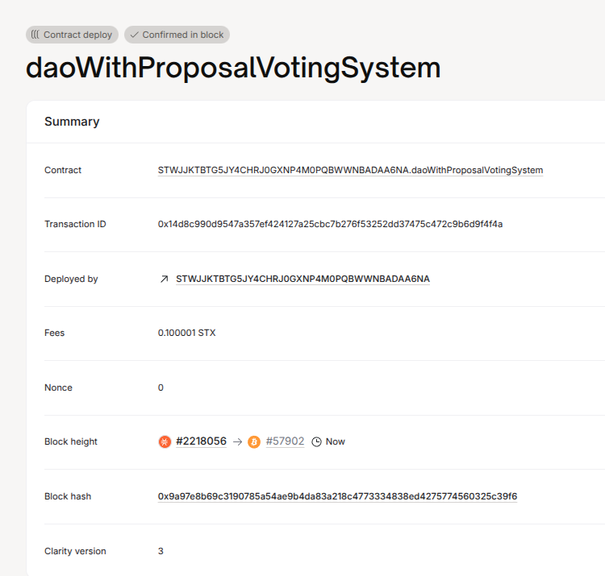

# DAO with Proposal & Voting System

## 📌 Project Description
A basic DAO smart contract that allows users to create proposals and vote on them. Each user can vote only once per proposal. Proposals record votes for and against, along with metadata like description and proposer.

## 🌐 Project Vision
To enable simple, community-driven governance mechanisms for decentralized communities and protocols on the Stacks blockchain.

## 🚀 Future Scope
- Add voting weight based on token holdings.
- Add quorum and deadline for proposals.
- Include proposal execution logic (on-chain actions).
- Integrate frontend with Clarity contract and Hiro Wallet.

## 🔗 Contract Address
STWJJKTBTG5JY4CHRJ0GXNP4M0PQBWWNBADAA6NA.daoWithProposalVotingSystem

